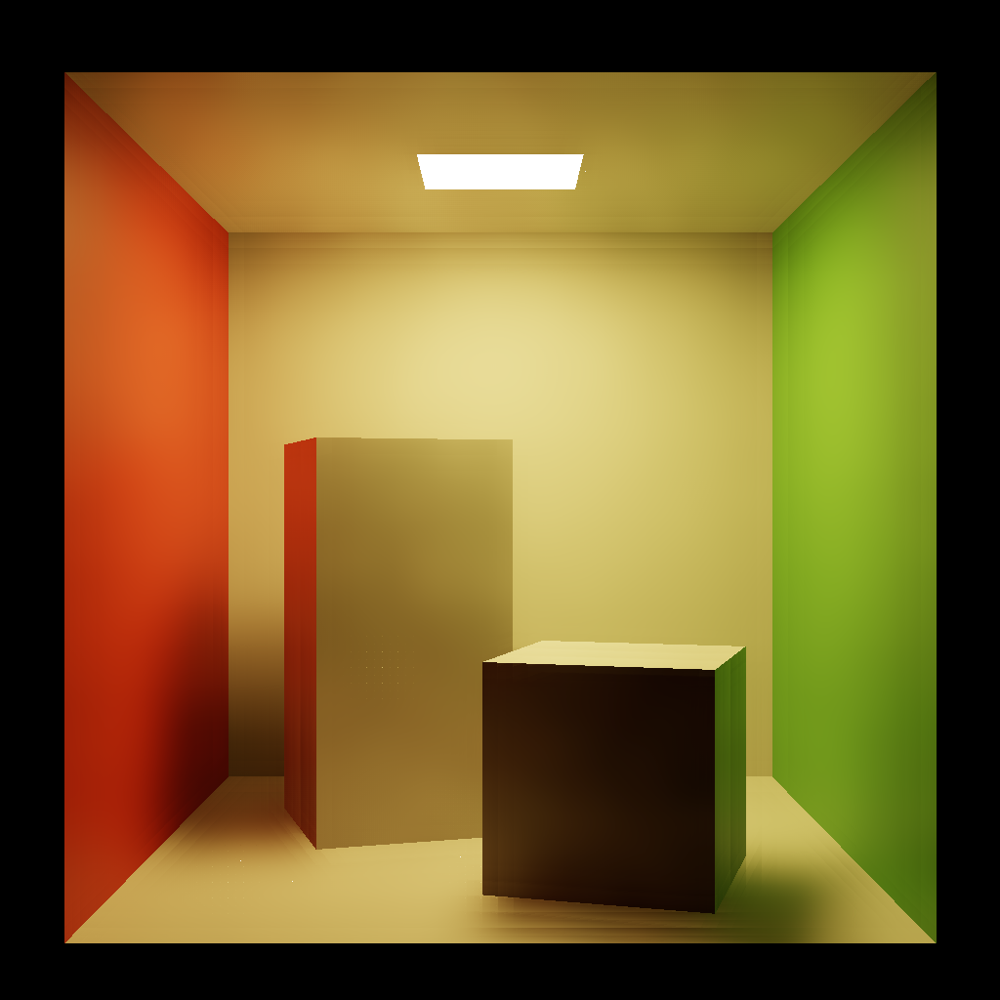

# Edge Avoiding A-Trous Wavelet Transform for Fast Global Illumination

Algorithm for denosing ray tracing outpus.

## Result
- Environment: RTX 2060
- Denoised result(8ms)

| Scene | Image | GPU time(A-Trous pass only) |
| - | - | - |
| Cornell Box |  | 8ms |
| Bistro |  | 10ms |
