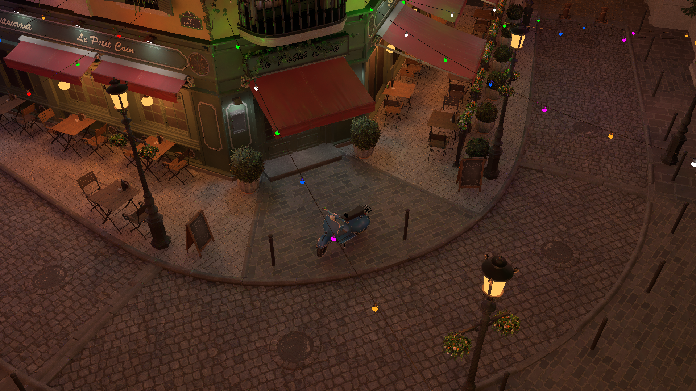

# Hime

Implementation of ray tracing techniques.

## Implementations
| Conference | Paper | Project Page | Result |
| ----------------- | ----- | ------------ | ------ |
| SIGGRAPH 2020 | [*Spatiotemporal Reservoir Resampling for Real-time Ray Tracing with Dynamic Direct Lighting*](https://cs.dartmouth.edu/wjarosz/publications/bitterli20spatiotemporal.html) | [ReSTIR](ReSTIR/) |  |
| I3D 2020 | [*Realtime Stochastic Lightcuts*](https://dqlin.xyz/pubs/2020-i3d-SLC/) | [RealtimeStochasticLightcuts](RealtimeStochasticLightcuts/) |  |
| HPG 2010 | [*Edge-avoiding À-Trous Wavelet Transform for Fast Global Illumination Filtering*](https://jo.dreggn.org/home/2010_atrous.pdf) | [ATrousWaveletFilter](ATrousWaveletFilter/) |  |
## Usage

### Documents
 - Usage, implementation notes, details and results can be found in README.md under respective folders.
 - Documents may contain [mermaid](https://mermaidjs.github.io/) diagrams. Plugin <u>Markdown Preview Enhanced(available both in [VSCode](https://github.com/shd101wyy/vscode-markdown-preview-enhanced) and [Atom](https://github.com/shd101wyy/markdown-preview-enhanced))</u> is recommended for reading documents.

### Build
Hime is developed based on, and also a submodule of [modified framework Falcor](https://github.com/VicentChen/Falcor.git). 

1. Clone [Falcor fork for Hime](https://github.com/VicentChen/Falcor.git): `git clone --recursive https://github.com/VicentChen/Falcor.git`.
2. Build. (Please follow official Falcor readme)
3. Download extra model files from: https://developer.nvidia.com/orca
4. Build entire solution with configuration `DebugD3D12` or `ReleaseD3D12`.

### Run
1. Set `Mogwai` as start up project.
2. Load render graph file in implementation folders (For example, `RealtimeStochasticLightcuts/RealtimeStochasticLightcuts.py`).
3. Load scene.

### Notes
- For some scenes, z-fighting issues may occur. You may need to modify camera near plan(camera depth) to 0.1.

(Please give me a star if this project helps you :smile:)
