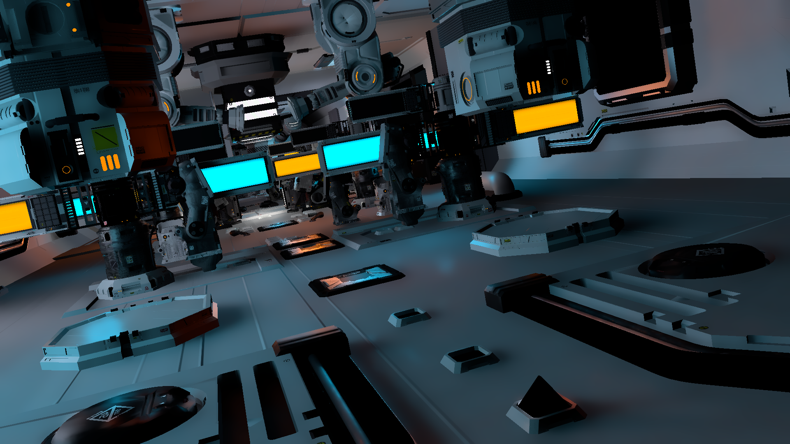
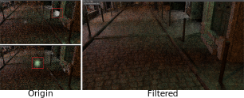

# ReSTIR

(This document contains formula and diagram, please read with plugin Markdown Preview Enhanced(available both in [VSCode](https://github.com/shd101wyy/vscode-markdown-preview-enhanced) and [Atom](https://github.com/shd101wyy/markdown-preview-enhanced)).)

This is an implementation of SIGGRAPH 2020 paper: *Spatiotemporal Reservoir Resampling for Real-Time Ray Tracing with Dynamic Direct Lighting*.

## Results
- Environment: RTX 2060
- Performance(Frame time, SVGF enabled): ~53ms

| Raw sampling output | SVGF filtered result |
| ------------------- | -------------------- |
|  |  |

## Implementation Notes

 - Basic process:

 - Reference: This implementation uses [RTXDI](https://developer.nvidia.com/rtxdi) as a reference. However, RTXDI uses griding strategy to improve ReSTIR, which was not implemented here. Also, some optimatizations(like sampling with mipmap) were not implemented neither.

### Generate Initial Candidates
 - In RTXDI, local light importance sampling is performed with mipmap. However, in original paper, local light importance sampling is based on their power, which was implemented with [Alias Table Method](https://en.wikipedia.org/wiki/Alias_method) by Falcor, in class EmissivePowerSampler. It seems that mipmap importance sampling can achieve better rendering result, but this implementation followed original paper's choice.

 - PDF: EmissivePowerSampler implemented by Falcor returns only the probability of choosing a point on an emissive triangle, which can be divided into two parts: 
 $$PDF_{Point}=PDF_{Light}*PDF_{UV}$$
    - Probability of choosing the emissive triangle (source pdf in shader code).
    - Probability of choosing the specific point on triangle (solid angle pdf in shader code).

### Temporal Reuse
 - **Boiling Filter.** RTXDI uses boiling filter to avoid unexpected reservoir propagate to neighbors by spatiotemporal reuse, which will lead to an area of picture suddenly lightened like picture below:
 

### Spatial Reuse

## TODOs
 - <u>Support light source intensity changing.</u> `EmissivePowerSampler` will sort all lights according to their intensity. If intensity changed, light index will change. An extra buffer to map current frame's light index to last frame is required.
 - <u>Optimize power sampler.</u> Falcor's EmissivePowerSampler sorts lights in CPU, which leads to low performance.
 - <u>Validate neighbor(both spatial and temporal) using their material.</u> RTXDI validates neighbors using depth, normal and material. For convenience, this implementation only use depth and normal.
 - <u>Bias correction.</u> RTXDI performs bias correction after both temporal reuse pass and spatial reuse pass.
