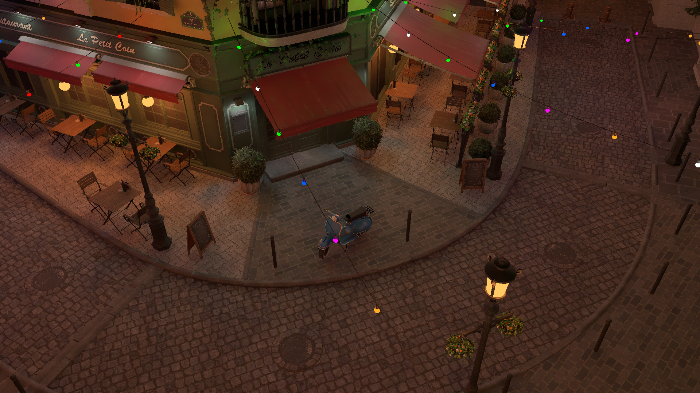

# Realtime Stochastic Lightcuts

Algorithm for rendering dynamic many-light scenes in realtime.

## Usage
 - `Use CPU sorter`: Check to sort lights in CPU.
 - `Cut size`: Number of nodes in one cut.
 - `Light sampels/vertex`: In this implementation, one shadow ray is corresponding to one lightcut node. If you want the final result, you should set this as the same as cut size.
