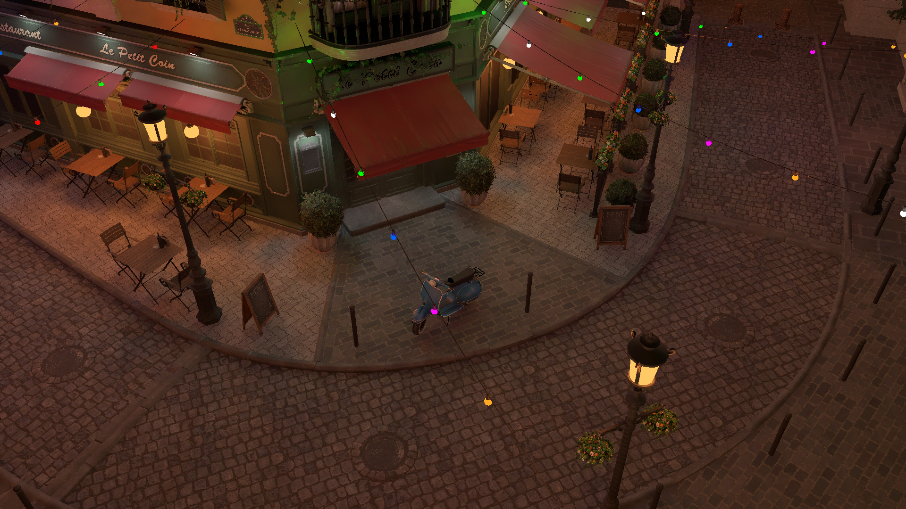

# Realtime Stochastic Lightcuts

This is an implementation of I3D 2020 paper: *Realtime Stochastic Lightcuts*.

## Result
- Environment: RTX 2060
- SVGF Denoised Result: (40fps)

## Usage
 - `Use CPU sorter`: Check to sort lights in CPU.
 - `Cut size`: Number of nodes in one cut.
 - `Light sampels/vertex`: In this implementation, one shadow ray is corresponding to one lightcut node. If you want the final result, you should set this as the same as cut size.

## Note
 - Check "Accumulate ground truth shadow ray" in "Hime Path Tracer Params, Ray Configurations". Otherwise scene will get darker.
